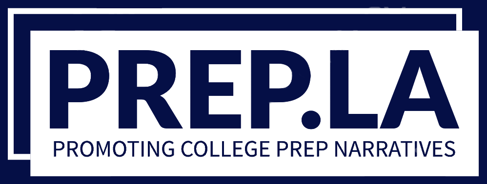

# PREP.LA
 <!---This works when rendered on GitHub, but not VSCode by default-->
## Promoting College Prep Narratives of UCLA Students from LA County

> An open-source project created by: Zack Pakin, Charles Zhang, and Vicky Delk

> ### **View our project live [_here_](https://czhangy.github.io/aa191a-inequality/index.html)**

## Table of Contents
* [🖼️ Background](#🖼️-background)
* [🎯 Objective](#🎯-objective)
* [💪 Empowerment](#💪-empowerment)
* [🖥️ Technology Utilized](#🖥️-technology-utilized)
* [♻️ Repurposing the Technology](#♻️-repurposing-the-technology)
* [🗺️ Features](#🗺️-features)

## 🖼️ Background

The support provided to students in their high schools can have a massive impact on the next stages of their life. However, the quality and accessibility of these resources can vary greatly from institution to institution. This can give more privileged individuals a massive head start coming out of high school, and creates educational inequality. Prep.LA focuses on the college prep aspect of this inequality by surveying UCLA students that grew up in Los Angeles (LA) County.

According to the Academic Policy Board (APB), UCLA receives the most applications out of any college in the US. Out of these applicants, 41% are first-generation students and 45% are from low-income households, so we have the opportunity to empower a diverse group of students and let their voices be heard.

## 🎯 Objective 

Prep.LA aims to share the stories of UCLA students who went to public high school in the LA County, with respect to their experiences with college preparation resources. We plan to incorporate an interactive, layered map that helps visualize the stories we have gathered and highlight barriers, specifically first-generation college student status and a low household income bracket that prevented UCLA students from accessing services while at an LA high school. Student input from our peers will allow us to understand the quality of college and career preparation resources and if they were accessible.

## 💪 Empowerment 
> This mapplication aims to empower college-aspiring high school students in LA county, families raising K-12 children in the LA area in the public school system, and teachers/school staff working with a lack of resources due to underfunding.

The main issue this project looks to bring awareness to is the information disparity created by the presence of preparatory resources in some high schools, but not in others. It's our hope that through Prep.LA, we can amplify the voices of students and the educational inequalities they've faced. This mapplication can empower educators and students by drawing on the voices and experiences of their communities to assist future generations. To best serve the UCLA student body, we can look to provide this mapplication to specialized programs within UCLA like [_First To Go_](https://firsttogo.ucla.edu/) to provide targeted support to disadvantaged groups, or even more general programs like [_First Year Experience_](https://firstyearexperience.ucla.edu/) or [_Academic Advising_](https://www.uclaextension.edu/student-support/academic-advising) to improve support for incoming students as a whole.

## 🖥️ Technology Utilized 

- Leaflet
  - We used leaflet for our project mapping. We imported a GeoJSON that contains multi-polygons with the neighborhoods/regions of LA county. 
  - Each affirmative response to our "Support in reaching college goals question" is aggregated per region and the percentage of "Yes" responses defines the color of the neighborhood (ex. 25% of students feel supported is red).
  - We used JavaScript for Leaflet, also importing PapaParse for our Google Form response parsing. We also included a library that supports a point-in-polygon calculation to match responses to neighborhoods.
- Google Forms
  - We used Google Forms due to its simple to use interface and powerful connection to Google Sheets.
  - Within Google Sheets, we have a script that calculates coordinated based on the location sent on the survey. This gives us our point for mapping.
  - We used PapaParse and conditional statements within JavaScript to manage our responses and include them in the map.
- VSCode
  - We used VSCode as our code editor, specifically the live server feature that allows us to see our changes live.
 - GitHub
   - We used GitHub as our Version Control System, allowing concurrent working on features through branching and pull requests.

## ♻️ Repurposing the Technology 

- Our dataset can be easily expanded to amplify more voices:
  - Limiting respondents to UCLA students makes the scope more manageable for the purposes of this project, but does bias the pool of respondents
    - What about students that didn't go to college?
    - What about students that went to other colleges?
  - This application can be relatively easily repurposed for other areas/counties, allowing allow more perspectives and stories to be featured
- High school students can use it to learn from older students who have been in their shoes
- Educators and school administrators can use it to learn about what resources students found most valuable and target their attention accordingly
- Local government officials can use it to learn about what resources are being most utilized at public high schools

## 🗺️ Features 
 Our mapplication features color-coded LA county neighborhoods/regions. The region's color, as shown in a key in the bottom right side of the map, is determined by the percentage of respondants that answered "Yes" to feeling supported in reaching college goals while in high school.

### Default View of LA County Regions
 

 ### Sample Region Popup with Stories Displayed
 

 The students considered in the color shading can be adjusted by using the checkboxes on the top right corner. For example, a user can filter stories to read those only from students who identify as first-generation people of color, but not those that are low-income or none of the above demographics. After selecting a region, a user can read through the stories shared with us by using the right pane. Advancing through stories can be done by using the left and right arrows at the bottom of the right pane. While a region is selected, a user will also see a popup over the region, detailing the breakdown of support feelings based on our responses.

### Filtered Region with Stories Displayed
 

 We also allow visitors to take the survey directly on our website by clicking the survey tab. After submitting a response, a user can expect their story to appear on our map within 30 seconds!

### [_Take Our Survey and Share your Story!_](https://czhangy.github.io/aa191a-inequality/survey.html)

